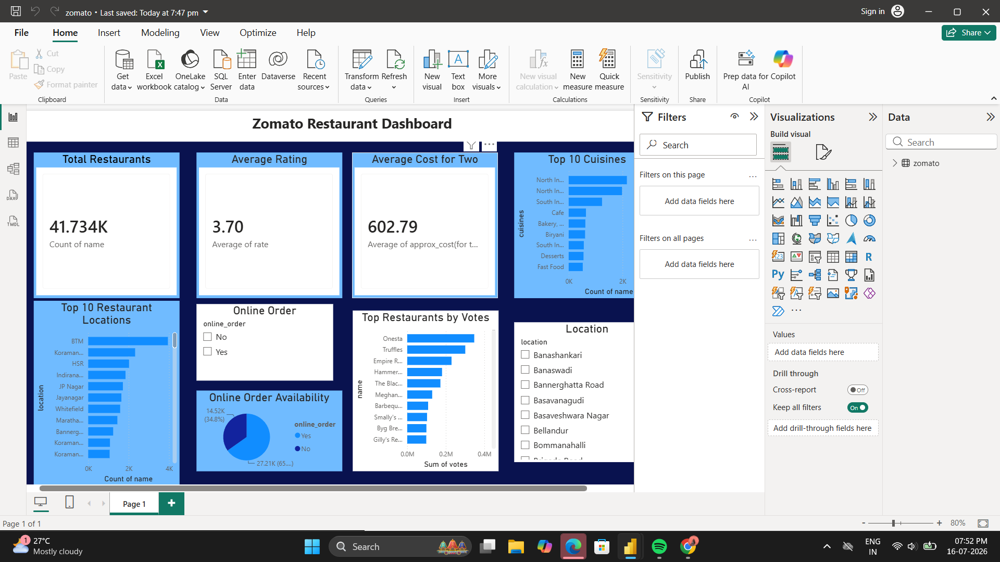

# 🍽️ Zomato Restaurant Analysis Dashboard

## 📌 Project Overview
This project analyzes the Zomato Restaurant dataset using Python and Power BI. The objective is to uncover restaurant trends, customer preferences, ratings, costs, cuisines, and online ordering patterns through interactive visualizations.

---

## 🛠️ Tools & Technologies
- Python
- Pandas
- NumPy
- Matplotlib
- Seaborn
- Power BI
- Git & GitHub

---

## 📊 Dashboard Features
- Total Restaurants
- Average Rating
- Average Cost for Two
- Top 10 Cuisines
- Top Restaurant Locations
- Top Restaurants by Votes
- Online Order Availability
- Interactive Filters (Location & Online Order)

---

## 📁 Project Structure

```
Zomato-Restaurant-Analysis
│
├── data/
├── images/
├── notebooks/
├── powerbi/
│   └── zomato.pbix
├── README.md
├── LICENSE
└── requirements.txt
```

---

## 📈 Key Insights
- Most restaurants have ratings between 3.5 and 4.0.
- North Indian cuisine is one of the most common cuisines.
- Online ordering is available for a large percentage of restaurants.
- Restaurant votes help identify the most popular restaurants.
- Average cost for two provides insights into pricing trends.

---

## 📸 Dashboard Preview



---

## 👨‍💻 Author
**Prarthana**
